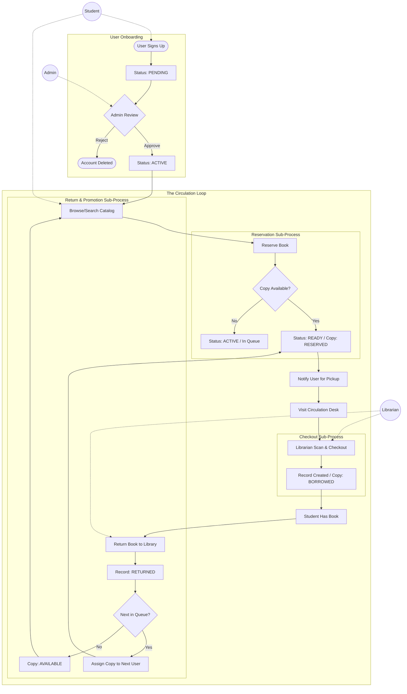
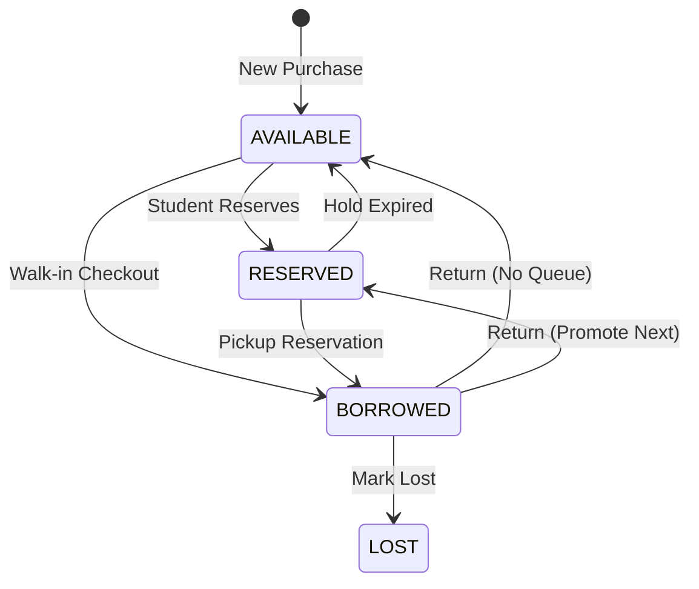
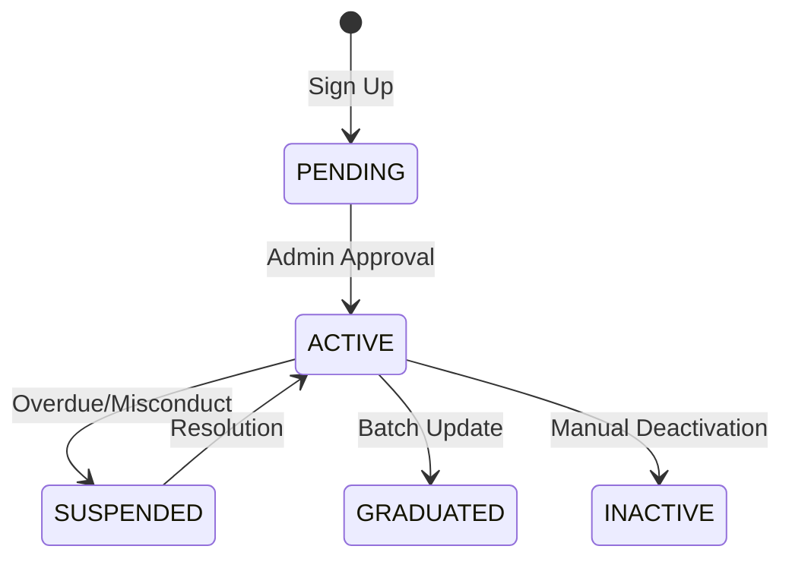

# Lumina LMS: Full System Lifecycle

This document provides a holistic view of the system's life cycle, from user onboarding to book circulation and automated maintenance.

## 1. The Integrated System Flow

This diagram connects all major sub-processes, showing how users and items interact throughout their life in the library.

## 2. Component Transitions (State Machine)

How entities change states based on specific triggers.

### A. Book Copy States

### B. User Profile States

## 3. The "Promotion" Logic (Critical Path)
When a book is returned, the system follows this logic to ensure fair access:

1.  **Mark Return**: Close the current borrowing record.
2.  **Queue Check**: Query `reservations` for the same `book_id` where `status = 'ACTIVE'`.
3.  **Atomic Promotion**:
    - If a user is found:
        - Update Reservation to `READY`.
        - Assign the physical `copy_id`.
        - Set `hold_expires_at` (usually 3 days).
        - Update Book Copy to `RESERVED`.
    - If no user:
        - Update Book Copy to `AVAILABLE`.

