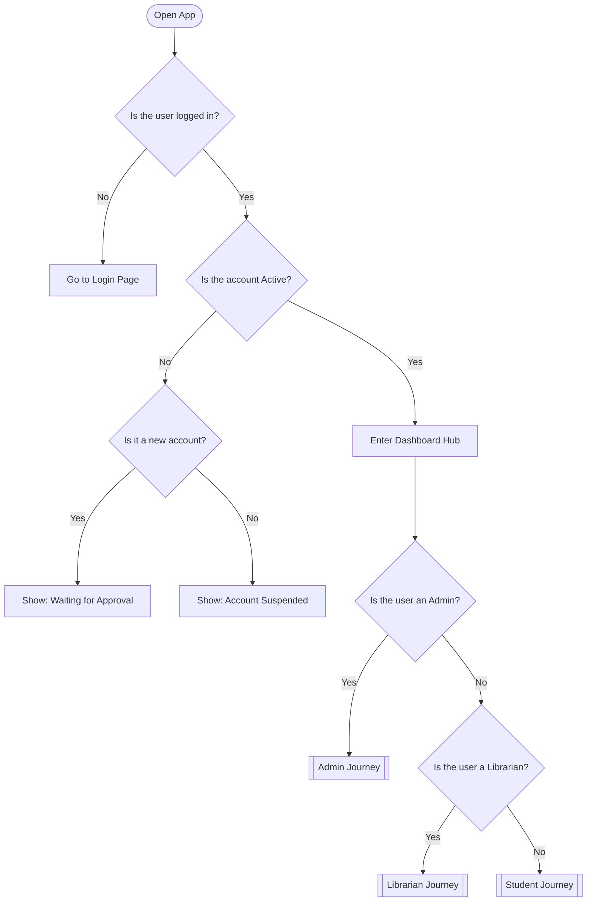

# Main System Journey

This is the high-level path every user takes upon entering the Lumina LMS. It handles authentication, security checks, and redirects to role-specific workspaces.

```mermaid
graph TD
    Start([Open App]) --> Auth{Is the user logged in?}
    Auth -- No --> Login[Go to Login Page]
    Auth -- Yes --> VerifyActive{Is the account Active?}
    
    %% Security Branching (Strict Binary)
    VerifyActive -- No --> VerifyPending{Is it a new account?}
    VerifyPending -- Yes --> Pending[Show: Waiting for Approval]
    VerifyPending -- No --> Suspended[Show: Account Suspended]
    
    %% Dashboard Hub
    VerifyActive -- Yes --> Dashboard[Enter Dashboard Hub]
    
    %% Role Branching (Strict Binary)
    Dashboard --> CheckAdmin{Is the user an Admin?}
    CheckAdmin -- Yes --> AdminPath[[Admin Journey]]
    
    CheckAdmin -- No --> CheckLib{Is the user a Librarian?}
    CheckLib -- Yes --> LibrarianPath[[Librarian Journey]]
    CheckLib -- No --> StudentPath[[Student Journey]]
```
