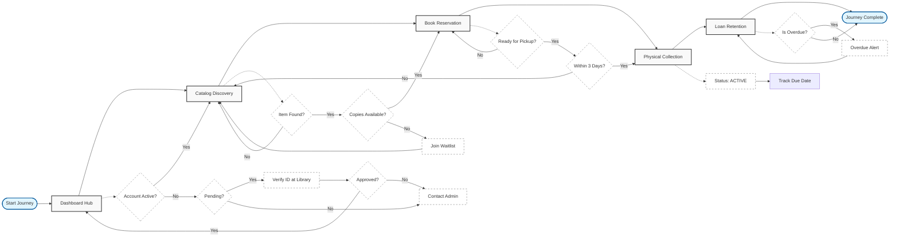

# Student Journey

This flowchart outlines the primary tasks for Students and Staff members, focusing on book discovery and personal record management.

```mermaid
graph LR
    %% Global Styling
    classDef spine fill:#f9f9f9,stroke:#333,stroke-width:2px;
    classDef branch fill:#fff,stroke:#666,stroke-dasharray: 5 5;
    classDef start_end fill:#e1f5fe,stroke:#01579b,stroke-width:2px;

    %% Main Spine (The Happy Path)
    StartS([Start Journey]) --> Dashboard[Dashboard Hub]
    Dashboard --> Catalog[Catalog Discovery]
    Catalog --> Reservation[Book Reservation]
    Reservation --> Pickup[Physical Collection]
    Pickup --> Retention[Loan Retention]
    Retention --> Return([Journey Complete])

    %% Side Branches (Functional Decomposition)

    %% 1. Account Status Branch
    Dashboard -.-> AccountActive{Account Active?}
    AccountActive -- Yes --> Catalog
    AccountActive -- No --> Pending{Pending?}
    Pending -- Yes --> Verify[Verify ID at Library]
    Verify --> Approved{Approved?}
    Approved -- Yes --> Dashboard
    Approved -- No --> Contact[Contact Admin]
    Pending -- No --> Contact

    %% 2. Discovery Details
    Catalog -.-> Found{Item Found?}
    Found -- Yes --> Available{Copies Available?}
    Found -- No --> Catalog
    Available -- Yes --> Reservation
    Available -- No --> Waitlist[Join Waitlist]
    Waitlist --> Catalog

    %% 3. Reservation Management
    Reservation -.-> Ready{Ready for Pickup?}
    Ready -- Yes --> WithinLimit{Within 3 Days?}
    Ready -- No --> Reservation
    WithinLimit -- Yes --> Pickup
    WithinLimit -- No --> Catalog

    %% 4. Collection Actions
    Pickup -.-> LoanActive[Status: ACTIVE]
    LoanActive --> Track[Track Due Date]

    %% 5. Retention Logic
    Retention -.-> IsOverdue{Is Overdue?}
    IsOverdue -- Yes --> Penalty[Overdue Alert]
    IsOverdue -- No --> Return
    Penalty --> Retention

    %% Apply Classes
    class StartS,Return start_end;
    class Dashboard,Catalog,Reservation,Pickup,Retention spine;
    class AccountActive,Pending,Verify,Approved,Contact,Found,Available,Waitlist,Ready,WithinLimit,IsOverdue,Penalty,LoanActive branch;
```

