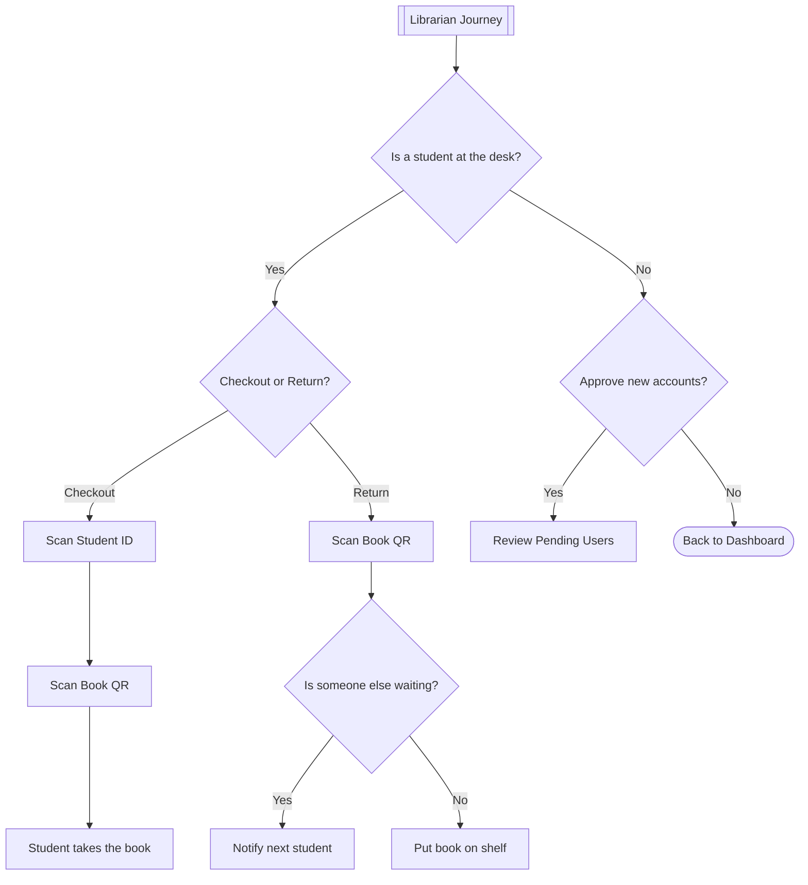

# Librarian Journey

This flowchart outlines the operational tasks for Librarians, including circulation management and member approvals.

```mermaid
graph TD
    StartL[[Librarian Journey]] --> Task{Is a student at the desk?}
    
    Task -- Yes --> Action{Checkout or Return?}
    
    %% Checkout Flow
    Action -- Checkout --> ScanID[Scan Student ID]
    ScanID --> ScanBook[Scan Book QR]
    ScanBook --> DoneC[Student takes the book]
    
    %% Return Flow
    Action -- Return --> ScanBookR[Scan Book QR]
    ScanBookR --> CheckWaiting{Is someone else waiting?}
    CheckWaiting -- Yes --> Promote[Notify next student]
    CheckWaiting -- No --> Shelf[Put book on shelf]
    
    Task -- No --> Approval{Approve new accounts?}
    Approval -- Yes --> Review[Review Pending Users]
    Approval -- No --> EndL([Back to Dashboard])
```
