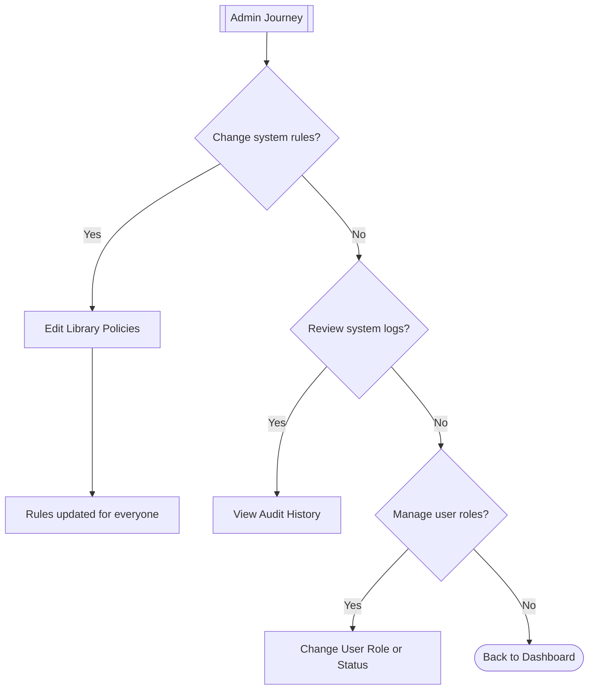

# Admin Journey

This flowchart outlines the high-level governance tasks performed by the System Administrator.

```mermaid
graph TD
    StartA[[Admin Journey]] --> Control{Change system rules?}
    
    Control -- Yes --> Policies[Edit Library Policies]
    Policies --> Saved[Rules updated for everyone]
    
    Control -- No --> Audit{Review system logs?}
    Audit -- Yes --> Logs[View Audit History]
    Audit -- No --> Roles{Manage user roles?}
    
    Roles -- Yes --> UserManage[Change User Role or Status]
    Roles -- No --> EndA([Back to Dashboard])
```
