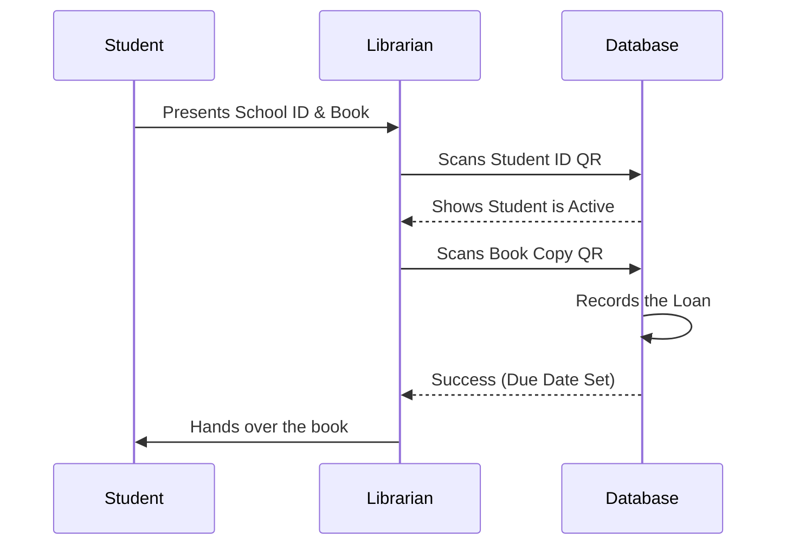

# Physical Interaction (Checkout)

This sequence diagram illustrates the step-by-step communication between the Student, Librarian, and System during a physical book checkout at the library counter.

