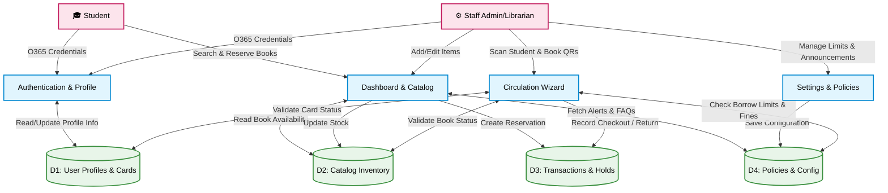

# Lumina Library Management System: Current System Data Flow Diagram

This document provides a Data Flow Diagram (DFD) based exactly on the currently implemented modules and functionalities of the Lumina LMS. It maps how information moves between the users, the system modules, and the database.

## Simple Mermaid Data Flow Diagram

### Diagram Breakdown

1.  **Authentication & Profile:** Both Students and Staff log in via O365. This module reads from and writes updates to the **User Profiles & Cards** database (including when users edit their department or address).
2.  **Dashboard & Catalog:** 
    *   **For Students:** This module reads book data from the **Catalog Inventory**, pulls Announcements/FAQs from the **Policies & Config** database, and writes to the **Transactions** database when a reservation is made.
    *   **For Staff:** This is their primary inventory tool where they push new book data directly to the **Catalog Inventory**.
3.  **Settings & Policies:** Staff use this to define system rules. The rules are saved into the **Policies & Config** database to govern the rest of the application.
4.  **Circulation Wizard:** The most complex data router. When Staff scan QRs here, the module pulls data from **User Profiles** (to verify the student is active), pulls from **Catalog Inventory** (to verify the book exists), pulls from **Policies & Config** (to check if the student has reached their borrow limit), and finally writes the outcome to the **Transactions** database.
