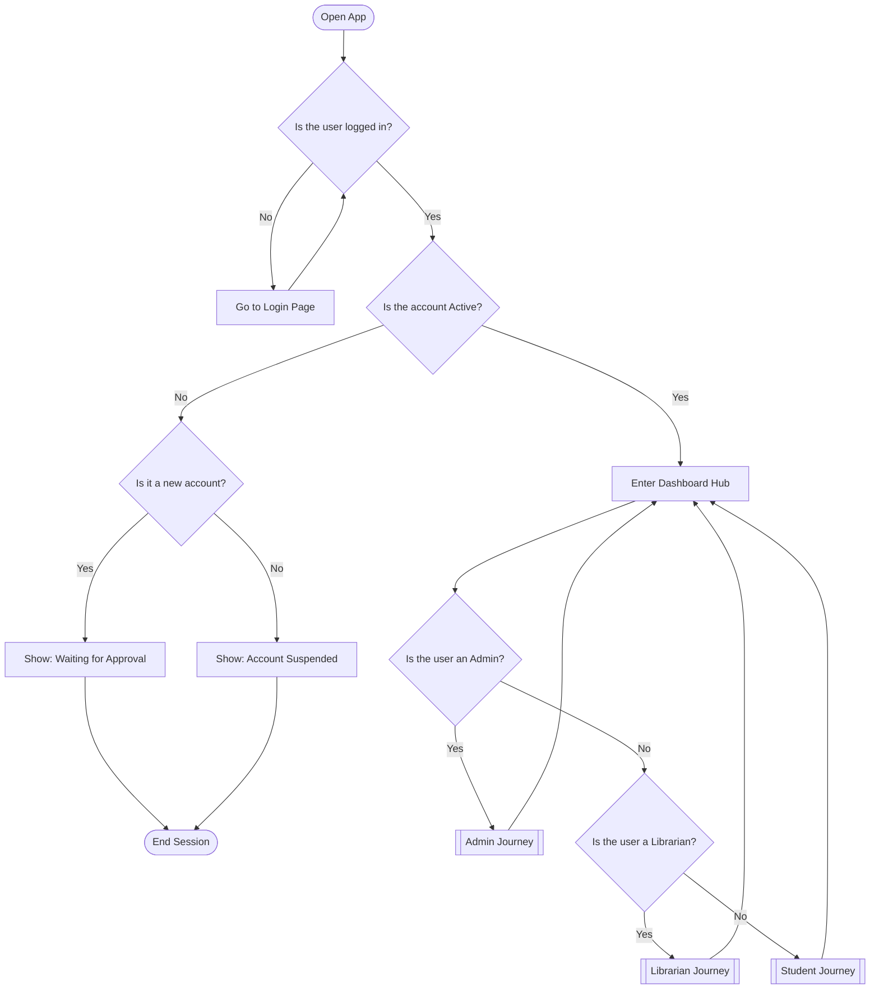
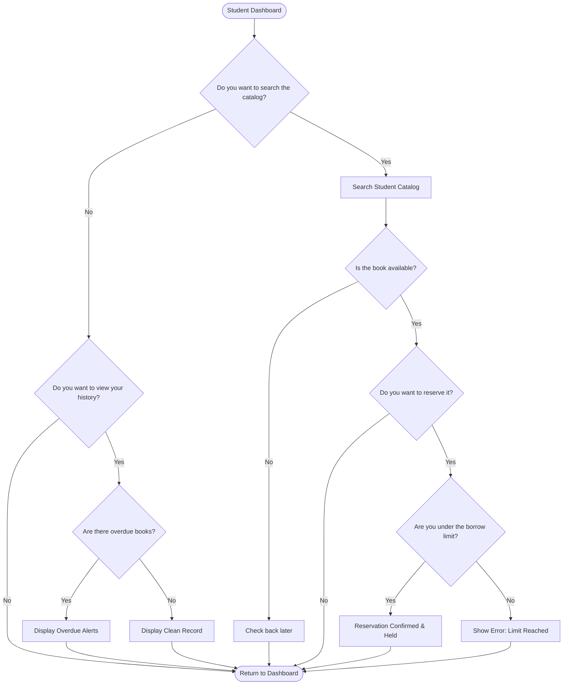
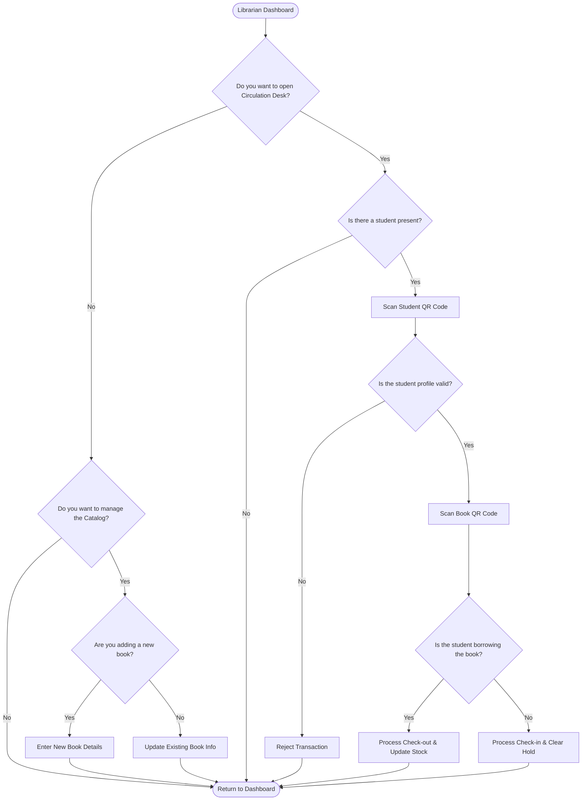
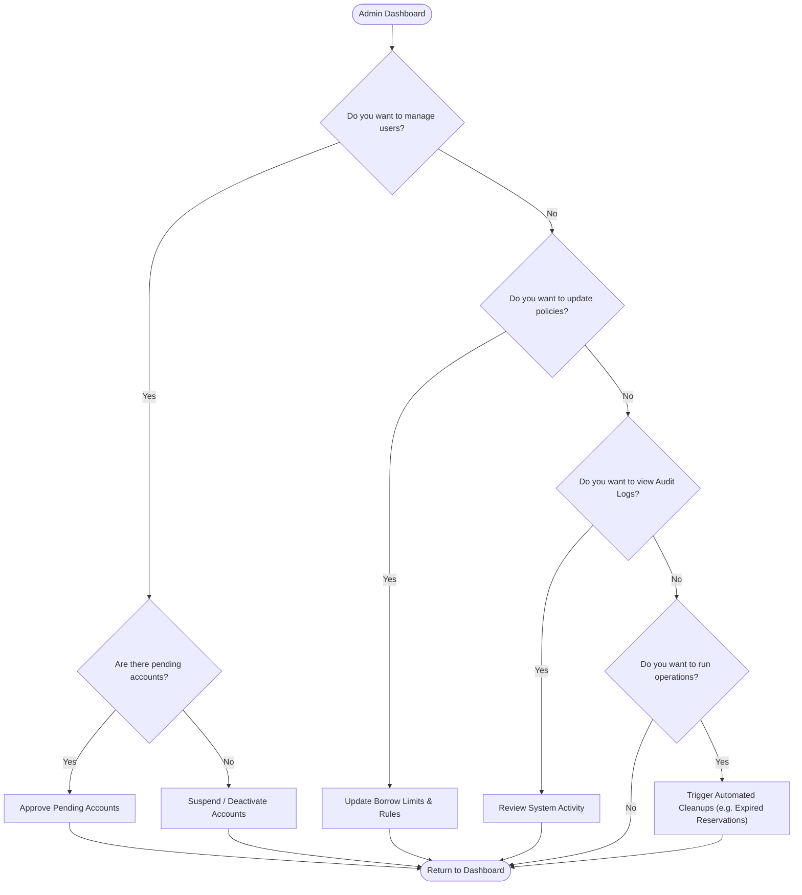

# Lumina Library Management System: Process Flowcharts

This document details the exact flow of the system, starting from the main authentication hub and branching into strict sub-processes (Journeys) based on the user's role. Every decision block is strictly binary (Yes/No), and every sub-process features a complete lifecycle that returns to the main dashboard.

## 1. Main Entry & Hub Routing
This flowchart handles authentication, account status verification, and strict role-based branching into the respective sub-processes.

---

## 2. Sub-Process: Student Journey
This flowchart details the interactions available to a student patron.

---

## 3. Sub-Process: Librarian Journey
This flowchart details the daily operations for library staff, focusing on circulation and catalog management.

---

## 4. Sub-Process: Admin Journey
This flowchart details the high-level configuration and system monitoring capabilities.

