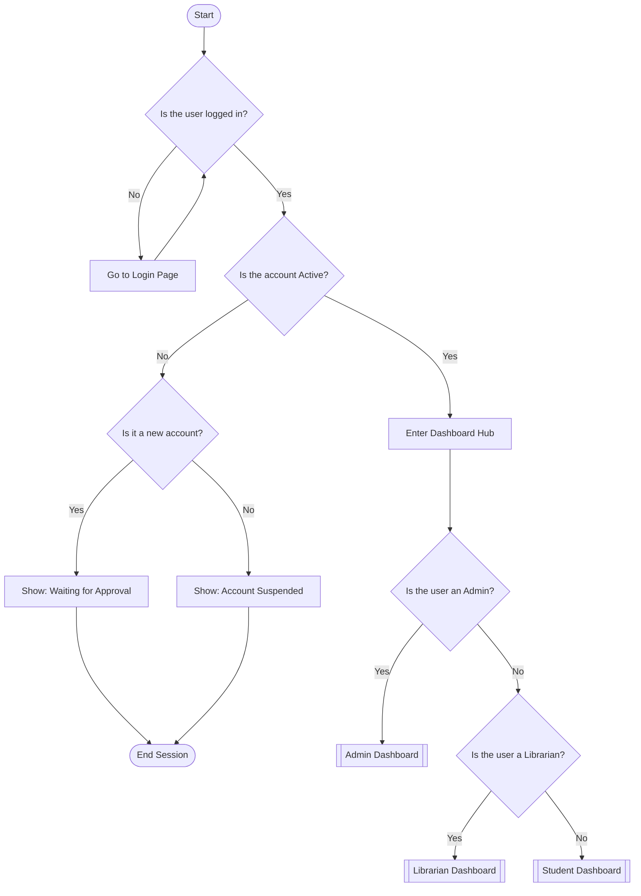

# 00. Main Entry & Hub Routing

This flowchart handles authentication, account status verification, and strict role-based branching into the respective sub-processes.

```mermaid
graph TD
    Start([Start]) --> Auth{Is the user logged in?}
    Auth -- No --> Login[Go to Login Page]
    Login --> Auth
    Auth -- Yes --> VerifyActive{Is the account Active?}

    %% Security Branching (Strict Binary)
    VerifyActive -- No --> VerifyPending{Is it a new account?}
    VerifyPending -- Yes --> Pending[Show: Waiting for Approval]
    Pending --> EndSession([End Session])
    VerifyPending -- No --> Suspended[Show: Account Suspended]
    Suspended --> EndSession

    %% Dashboard Hub
    VerifyActive -- Yes --> Dashboard[Enter Dashboard Hub]

    %% Role Branching (Strict Binary)
    Dashboard --> CheckAdmin{Is the user an Admin?}

    %% Admin Branch
    CheckAdmin -- Yes --> AdminPath[["Admin Dashboard"]]
    click AdminPath "Admin/00_Admin_Journey.md" "Go to Admin Journey"

    %% Librarian/Student Branch
    CheckAdmin -- No --> CheckLib{Is the user a Librarian?}
    CheckLib -- Yes --> LibrarianPath[["Librarian Dashboard"]]
    click LibrarianPath "Librarian/00_Librarian_Journey.md" "Go to Librarian Journey"

    CheckLib -- No --> StudentPath[["Student Dashboard"]]
    click StudentPath "Student/00_Student_Journey.md" "Go to Student Journey"
```
