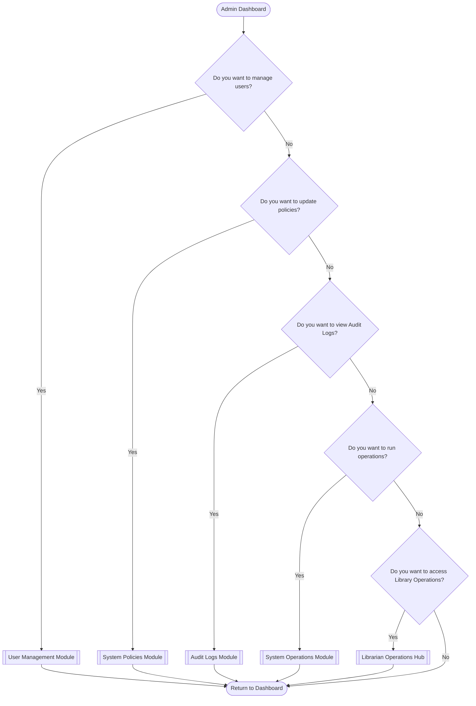

# 00. Admin Journey Hub

This flowchart routes Admin tasks to specific modules. *Note: Administrators also have full access to all Librarian modules (Circulation and Catalog Management).*

[Return to Main Flow](../00_Main_Entry_Flow.md)
