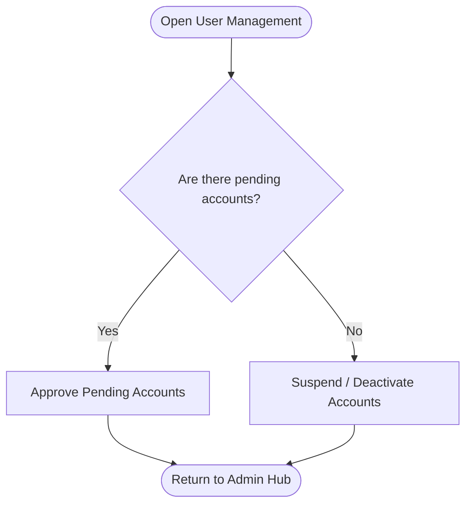

# 01. User Management Module

```mermaid
graph TD
    StartUser([Open User Management]) --> HasPending{Are there pending accounts?}
    
    HasPending -- Yes --> ApproveUser[Approve Pending Accounts]
    HasPending -- No --> SuspendUser[Suspend / Deactivate Accounts]
    
    ApproveUser --> EndUser([Return to Admin Hub])
    SuspendUser --> EndUser
```

[Back to Admin Hub](00_Admin_Journey.md)
