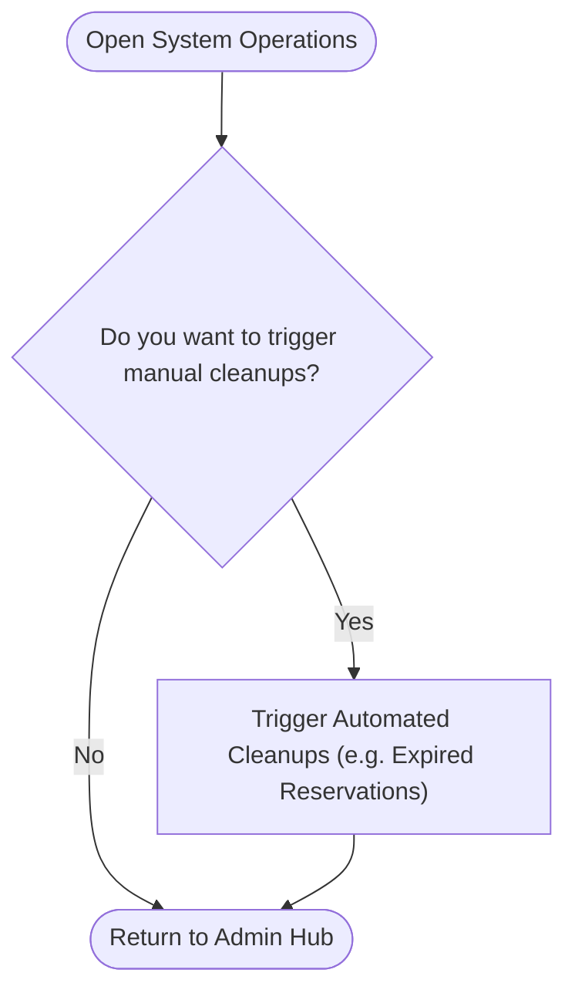

# 04. System Operations Module

```mermaid
graph TD
    StartOps([Open System Operations]) --> WantRun{Do you want to trigger manual cleanups?}
    
    WantRun -- Yes --> RunCleanup["Trigger Automated Cleanups (e.g. Expired Reservations)"]
    WantRun -- No --> EndOps([Return to Admin Hub])
    
    RunCleanup --> EndOps
```

[Back to Admin Hub](00_Admin_Journey.md)
