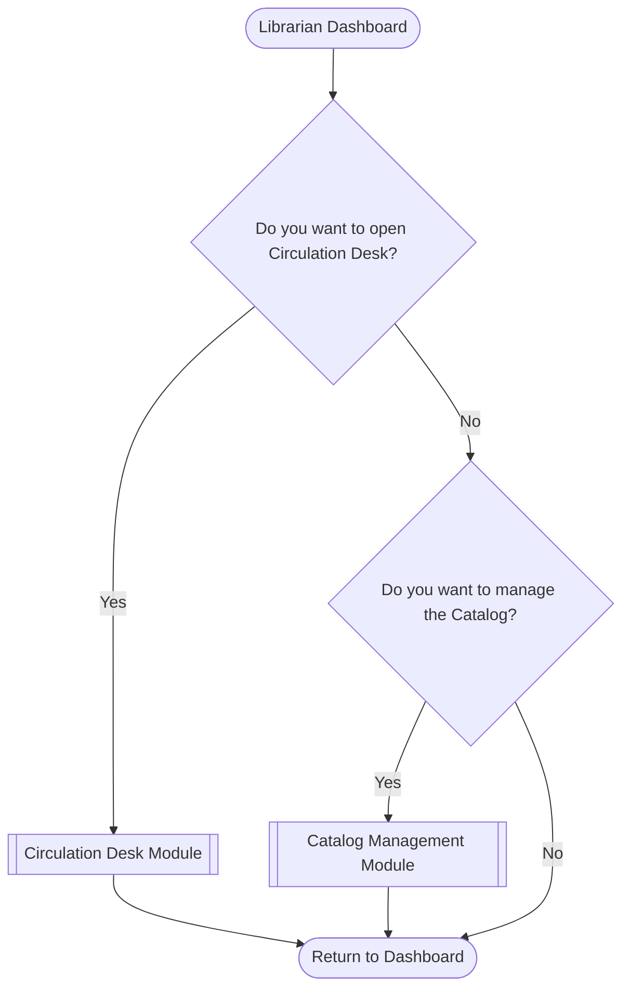

# 00. Librarian Journey Hub

This flowchart routes Librarian tasks to specific operational modules.

```mermaid
graph TD
    StartLib([Librarian Dashboard]) --> WantCirc{Do you want to open Circulation Desk?}
    
    WantCirc -- Yes --> CircDesk[["Circulation Desk Module"]]
    click CircDesk "01_Circulation_Desk.md" "Go to Circulation Desk"
    
    WantCirc -- No --> WantCat{Do you want to manage the Catalog?}
    WantCat -- Yes --> CatMng[["Catalog Management Module"]]
    click CatMng "02_Catalog_Management.md" "Go to Catalog Management"
    
    WantCat -- No --> EndLib([Return to Dashboard])
    
    CircDesk --> EndLib
    CatMng --> EndLib
```

[Return to Main Flow](../00_Main_Entry_Flow.md)
