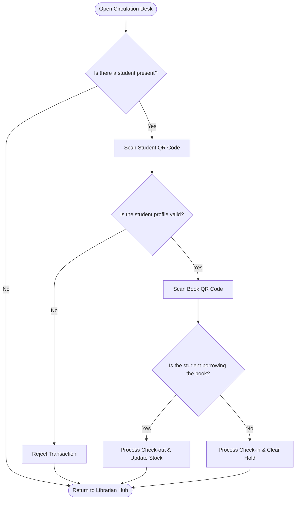

# 01. Circulation Desk Module

```mermaid
graph TD
    StartCirc([Open Circulation Desk]) --> HasStudent{Is there a student present?}
    
    HasStudent -- No --> EndCirc([Return to Librarian Hub])
    HasStudent -- Yes --> ScanQR[Scan Student QR Code]
    
    ScanQR --> VerifyStudent{Is the student profile valid?}
    VerifyStudent -- No --> RejectTrans[Reject Transaction]
    RejectTrans --> EndCirc
    
    VerifyStudent -- Yes --> ScanBook[Scan Book QR Code]
    ScanBook --> IsBorrow{Is the student borrowing the book?}
    
    IsBorrow -- Yes --> Checkout[Process Check-out & Update Stock]
    IsBorrow -- No --> Checkin[Process Check-in & Clear Hold]
    
    Checkout --> EndCirc
    Checkin --> EndCirc
```

[Back to Librarian Hub](00_Librarian_Journey.md)
