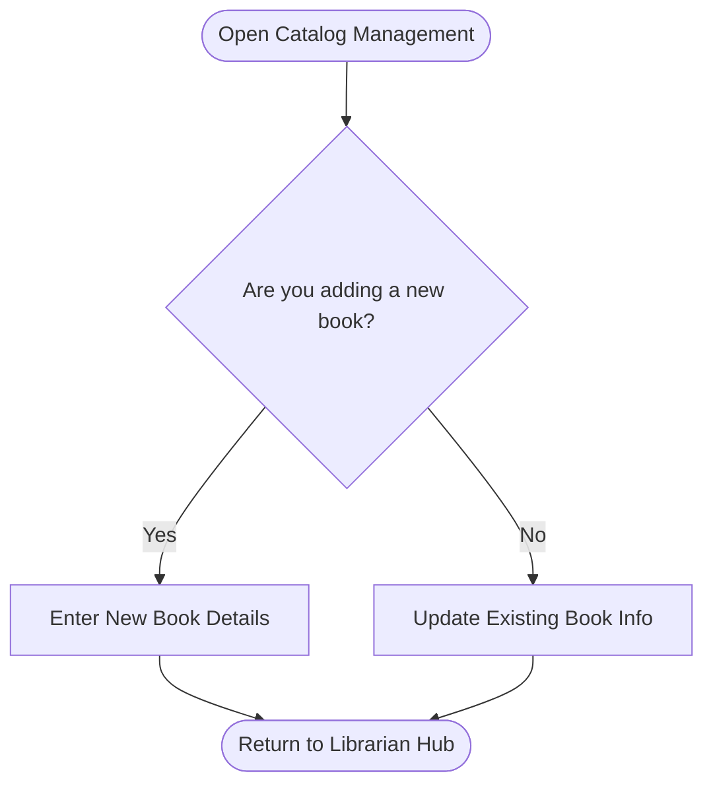

# 02. Catalog Management Module

```mermaid
graph TD
    StartCat([Open Catalog Management]) --> IsAdd{Are you adding a new book?}
    
    IsAdd -- Yes --> AddBook[Enter New Book Details]
    IsAdd -- No --> EditBook[Update Existing Book Info]
    
    AddBook --> EndCat([Return to Librarian Hub])
    EditBook --> EndCat
```

[Back to Librarian Hub](00_Librarian_Journey.md)
