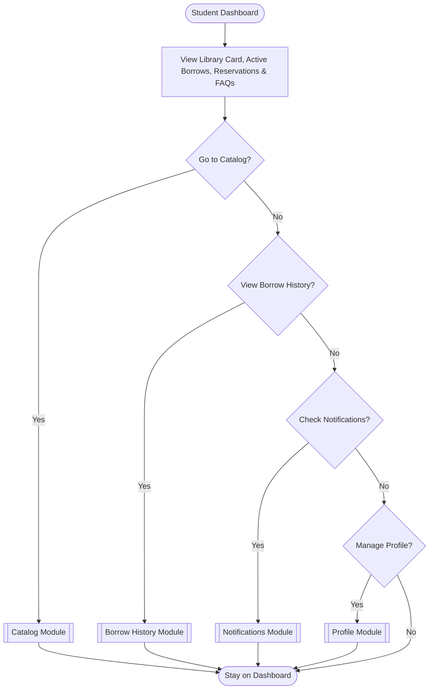

# 00. Student Journey Hub

This flowchart serves as the landing pad for the Student Journey. The dashboard immediately displays your Library Card, Current Reservations, Active Borrows, and FAQs before routing you to specific feature modules.

[Return to Main Flow](../00_Main_Entry_Flow.md)
