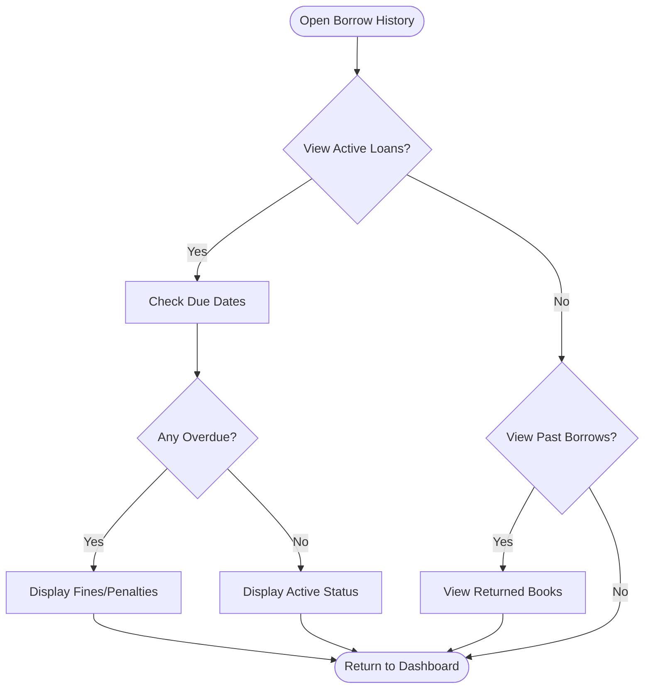

# 02. Borrowing History Module

```mermaid
graph TD
    StartHist([Open Borrow History]) --> CheckActive{View Active Loans?}
    
    CheckActive -- Yes --> ViewDue[Check Due Dates]
    CheckActive -- No --> CheckPast{View Past Borrows?}
    
    CheckPast -- Yes --> ViewPast[View Returned Books]
    CheckPast -- No --> EndHist([Return to Dashboard])
    
    ViewDue --> IsOverdue{Any Overdue?}
    IsOverdue -- Yes --> ShowFines[Display Fines/Penalties]
    IsOverdue -- No --> ShowClean[Display Active Status]
    
    ShowFines --> EndHist
    ShowClean --> EndHist
    ViewPast --> EndHist
```

[Back to Student Hub](00_Student_Journey.md)
