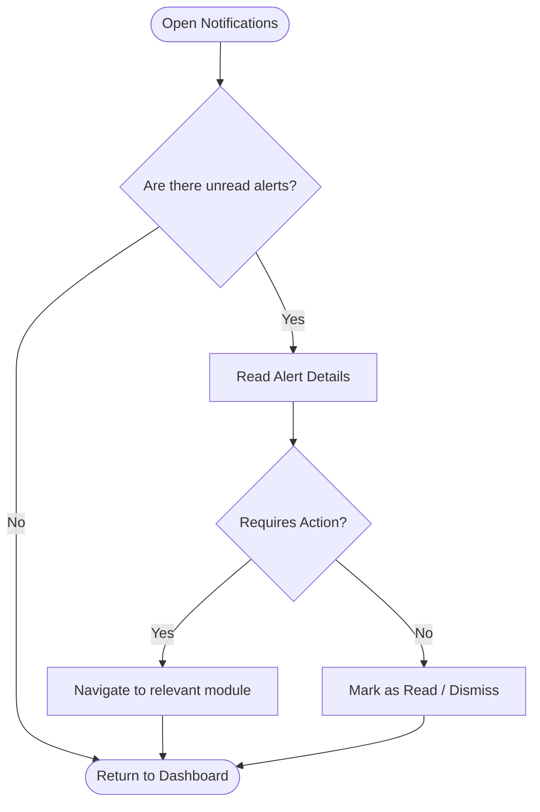

# 03. Notifications Module

```mermaid
graph TD
    StartNotif([Open Notifications]) --> HasUnread{Are there unread alerts?}
    
    HasUnread -- No --> EndNotif([Return to Dashboard])
    HasUnread -- Yes --> ReadAlert[Read Alert Details]
    
    ReadAlert --> IsImportant{Requires Action?}
    IsImportant -- Yes --> ActionTake[Navigate to relevant module]
    IsImportant -- No --> MarkRead[Mark as Read / Dismiss]
    
    ActionTake --> EndNotif
    MarkRead --> EndNotif
```

[Back to Student Hub](00_Student_Journey.md)
