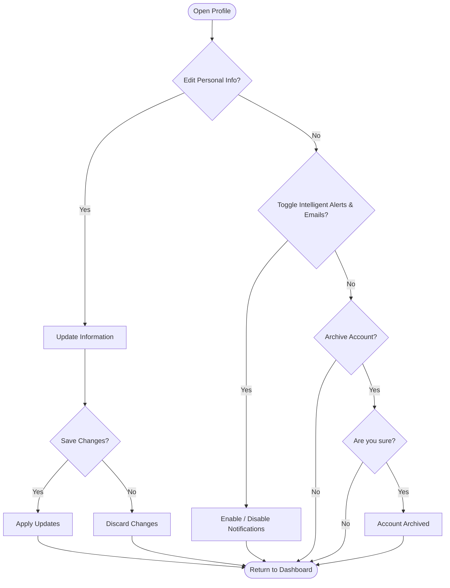

# 04. Profile Module

```mermaid
graph TD
    StartProf([Open Profile]) --> WantEdit{Edit Personal Info?}

    %% Information Editing Flow
    WantEdit -- Yes --> EditInfo[Update Information]
    EditInfo --> SaveCheck{Save Changes?}
    SaveCheck -- Yes --> Save[Apply Updates]
    SaveCheck -- No --> Discard[Discard Changes]
    Save --> EndProf([Return to Dashboard])
    Discard --> EndProf

    %% Alerts Toggle Flow
    WantEdit -- No --> WantNotif{Toggle Intelligent Alerts & Emails?}
    WantNotif -- Yes --> ToggleAlerts[Enable / Disable Notifications]
    ToggleAlerts --> EndProf

    %% Archive Account Flow
    WantNotif -- No --> WantArchive{Archive Account?}
    WantArchive -- No --> EndProf
    WantArchive -- Yes --> ConfirmArchive{Are you sure?}

    ConfirmArchive -- No --> EndProf
    ConfirmArchive -- Yes --> ProcessArchive[Account Archived]
    ProcessArchive --> EndProf
```

[Back to Student Hub](00_Student_Journey.md)
