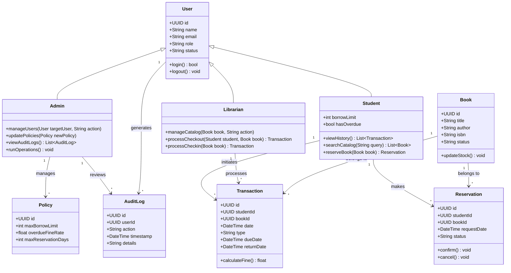

# Lumina Library Management System: UML Class Diagram

This document contains the UML Class Diagram for the Lumina Library Management System, illustrating the core entities, their attributes, methods, and relationships. It is modeled based on the system's role-based journeys and entities.

