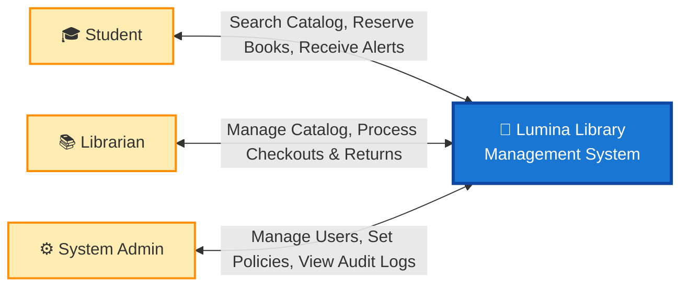
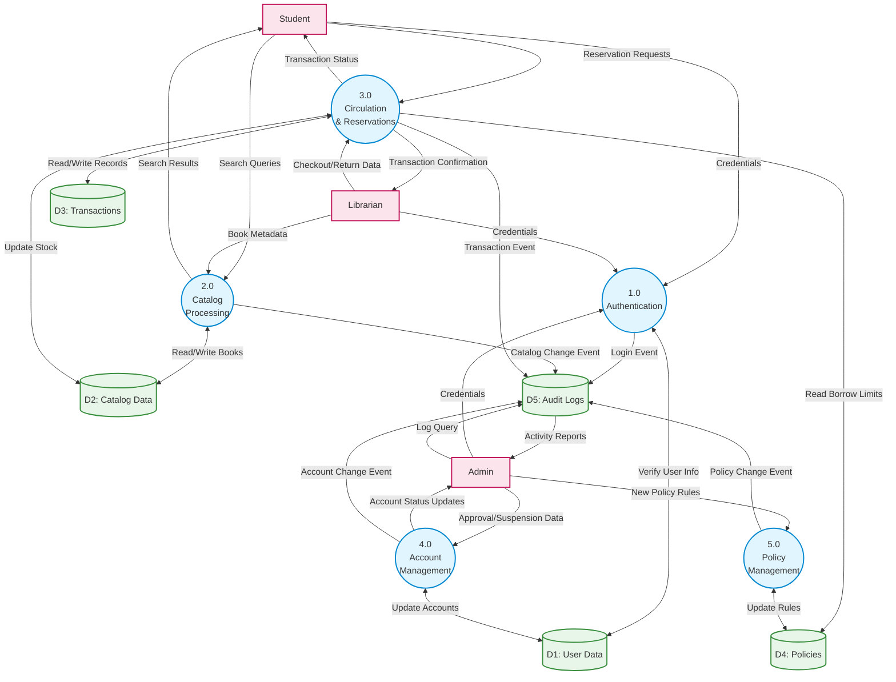

# Lumina Library Management System: Unified System Data Flow Diagram

## 1. High-Level Context Diagram (For Stakeholders)
The Context Diagram (Level-0 DFD) provides a bird's-eye view of the system. It treats the entire Library Management System as a single entity and illustrates the primary information exchanged between the system and its users. It is designed to be easily understood by non-technical stakeholders.

## 2. Detailed Data Flow Diagram (For Technical Team)
The Level-1 Data Flow Diagram (DFD) breaks down the main system into its core internal processes and data stores. It focuses on how data moves through the system, identifying external entities (inputs/outputs), core processes, and persistent data stores. This replaces the previous step-by-step flowchart to better represent information routing rather than sequential actions.

