# Library Management System - Unified Database Schema

This document provides a single, comprehensive view of the entire database architecture, showing how all modules interconnect within the system.

---

## Unified System Architecture

```mermaid
erDiagram
    %% Core Library Logic
    CATEGORIES ||--o{ BOOKS : ""
    BOOKS ||--o{ BOOK_COPIES : ""
    BOOKS ||--o{ RESERVATIONS : ""
    BOOKS ||--o{ REPORTS : ""
    
    BOOK_COPIES ||--o{ BORROWING_RECORDS : ""
    BOOK_COPIES |o--o{ RESERVATIONS : ""
    
    BORROWING_RECORDS ||--o{ RENEWALS : ""
    
    %% Identity & Authentication
    AUTH_USERS ||--|| PROFILES : ""
    AUTH_USERS ||--o{ RATE_LIMIT_LOG : ""
    AUTH_USERS ||--o{ REPORTS : ""
    
    %% Profile Relationships
    PROFILES ||--o{ BORROWING_RECORDS : ""
    PROFILES ||--o{ RESERVATIONS : ""
    PROFILES ||--o{ RENEWALS : ""
    PROFILES ||--o| LIBRARY_CARDS : ""
    PROFILES ||--o{ NOTIFICATIONS : ""
    PROFILES ||--o| UI_PREFERENCES : ""
    PROFILES ||--o{ AUDIT_LOGS : ""
    PROFILES ||--o| DELETED_PROFILE_INFO : ""
    PROFILES ||--o{ CHECKOUT_IDEMPOTENCY : ""
    PROFILES ||--o{ RETURN_IDEMPOTENCY : ""
    PROFILES ||--o{ SYSTEM_SETTINGS : ""

    CATEGORIES {
        uuid id PK
        varchar name
        text slug
        text description
        boolean is_active
    }

    BOOKS {
        uuid id PK
        uuid category_id FK
        varchar title
        varchar author
        varchar isbn
        text cover_url
        text[] tags
        varchar location
        varchar section
        int total_copies
        int available_copies
        boolean is_active
    }

    BOOK_COPIES {
        uuid id PK
        uuid book_id FK
        varchar qr_string
        varchar status "AVAILABLE, BORROWED, MAINTENANCE, LOST, RESERVED"
        varchar condition
    }

    BORROWING_RECORDS {
        uuid id PK
        uuid user_id FK
        uuid book_copy_id FK
        uuid processed_by FK
        uuid returned_by FK
        timestamptz borrowed_at
        timestamptz due_date
        timestamptz returned_at
        varchar status "ACTIVE, RETURNED, OVERDUE"
        int renewal_count
        boolean reminder_sent
    }

    RENEWALS {
        uuid id PK
        uuid borrowing_record_id FK
        uuid renewed_by FK
        timestamptz renewed_at
        timestamptz new_due_date
    }

    RESERVATIONS {
        uuid id PK
        uuid user_id FK
        uuid book_id FK
        uuid copy_id FK
        int queue_position
        varchar status "ACTIVE, CANCELLED, FULFILLED, EXPIRED"
        timestamptz reserved_at
        timestamptz hold_expires_at
        timestamptz fulfilled_at
    }

    REPORTS {
        uuid id PK
        uuid book_id FK
        uuid user_id FK
        text notes
        varchar status "pending, resolved, dismissed"
    }

    PROFILES {
        uuid id PK
        text full_name
        text email
        text student_id
        text department
        text phone
        text address
        text avatar_url
        varchar role "admin, librarian, student"
        varchar status "ACTIVE, SUSPENDED, GRADUATED"
        boolean onboarding_completed
    }

    AUTH_USERS {
        uuid id PK "Supabase Auth"
    }

    LIBRARY_CARDS {
        uuid id PK
        uuid user_id FK
        text card_number
        varchar status "pending, active, suspended, expired"
        timestamptz issued_at
        timestamptz expires_at
    }

    NOTIFICATIONS {
        uuid id PK
        uuid user_id FK
        text title
        text content
        varchar type "SYSTEM, BORROW, RESERVATION"
        varchar priority "low, medium, high"
        boolean is_read
        jsonb metadata
    }

    AUDIT_LOGS {
        uuid id PK
        uuid admin_id FK
        uuid entity_id
        text action
        text entity_type
        text reason
        jsonb old_value
        jsonb new_value
        jsonb details
    }

    SYSTEM_SETTINGS {
        uuid id PK
        uuid updated_by FK
        text key
        text value
        text data_type
        text description
    }

    UI_PREFERENCES {
        uuid id PK
        uuid user_id FK
        jsonb preferences
    }

    CHECKOUT_IDEMPOTENCY {
        uuid id PK
        uuid librarian_id FK
        text idempotency_key
        text card_number
        text book_qr
        jsonb response
    }

    RETURN_IDEMPOTENCY {
        uuid id PK
        uuid librarian_id FK
        text idempotency_key
        text book_qr
        jsonb response
    }

    RATE_LIMIT_LOG {
        uuid id PK
        uuid user_id FK
        text action_key
    }

    DELETED_PROFILE_INFO {
        uuid id PK
        uuid original_profile_id FK
        timestamp anonymized_at
        text deletion_reason
        int retained_borrow_count
        int retained_fine_count
    }
```

> [!NOTE]
> **Metadata Columns**: Technical columns such as `created_at`, `updated_at`, and `search_vector` have been omitted from the visual diagrams to improve clarity for the Capstone documentation. All tables utilize UUID primary keys for security and scalability.
