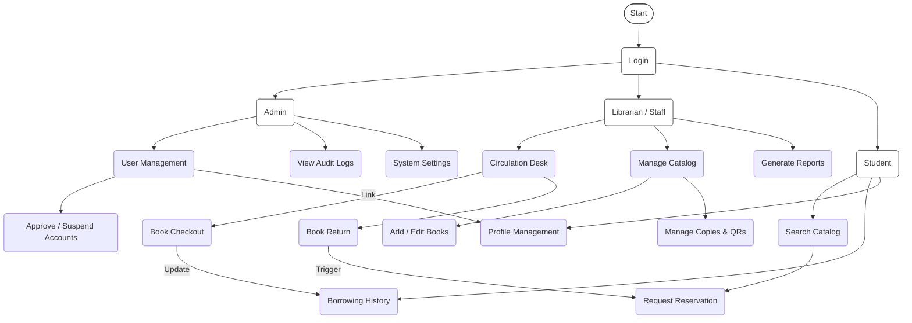

# Lumina LMS: System Functional Map

This diagram illustrates the branched architecture of the system, showing how different user roles navigate to their specific tasks from a central login point.

## System Navigation Breakdown

- **Central Access**: All workflows originate from a secure **Login** point.
- **Admin Branch**: Focuses on governance, including **User Management** (approving or suspending accounts) and monitoring the system via **Audit Logs**.
- **Librarian Branch**: Handles the day-to-day operations. The **Circulation Desk** is the hub for Checkouts and Returns, while **Catalog Management** ensures the digital inventory is up to date.
- **Student Branch**: Provides self-service options. Students can **Search the Catalog**, request **Reservations**, and track their personal **Borrowing History**.
- **Cross-System Logic**: Some actions are interconnected—for example, returning a book (`Return`) can automatically trigger a pending reservation (`Reserve`) for another student.
